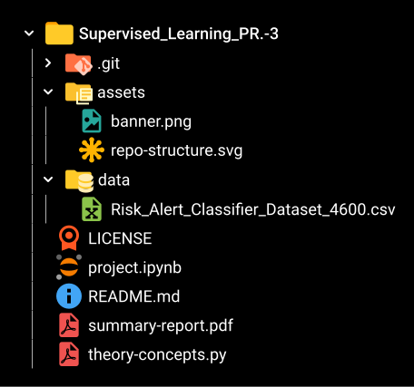

<div align="center">
	
</div>

# 💬 Message Intelligence System

<div align="center">


</div>

---

## 📚 Overview

Welcome to the **Message Intelligence System**! This project applies supervised learning to classify digital messages as either legitimate or spam using a structured dataset of message and sender behavior features. It is designed as a comprehensive academic submission that demonstrates preprocessing, model training, probability-based reasoning, and comparative evaluation.

---

## 📝 Project Title

### 💬 Message Intelligence System

---

## 👨‍🎓 Student Submission

> _This repository is submitted as part of coursework to demonstrate mastery of supervised learning, model evaluation, and optimization._

---

## 🎯 Objective

The objective of this project is to design a **classification system** that identifies whether incoming digital messages are **Spam or Legitimate**. Students will combine **probability theory** with **distance-based, margin-based, and probabilistic classifiers**, and analyze how different assumptions impact model performance.

---

## 📑 Problem Statement

You are working as a **Data Scientist** for a communication security company. The company wants to build a **Message Intelligence System** that can automatically classify user messages as:

- **0 → Legitimate Message**
- **1 → Spam Message**

The dataset contains **message-related features** extracted from text (numerical summaries) and **user behavior signals**. Some features are highly correlated, while others follow probabilistic patterns. Your task is to **build and compare multiple classification models** and explain their performance using **probability concepts**.

---

## 📂 Repository Structure



---

## 📊 Results & Analysis

The notebook was built and evaluated on the provided dataset containing 5,200 messages and 12 input features such as message length, word count, URL count, numeric content, special characters, spam/legit keyword scores, and sender activity features. The data was standardized and split into an 80/20 stratified train-test set.

### Model Performance Summary

| Model       | Accuracy | Precision | Recall | F1 Score |
| ----------- | -------: | --------: | -----: | -------: |
| KNN         |   1.0000 |    1.0000 | 1.0000 |   1.0000 |
| SVM         |   1.0000 |    1.0000 | 1.0000 |   1.0000 |
| Naive Bayes |   1.0000 |    1.0000 | 1.0000 |   1.0000 |

### Interpretation

- All three classifiers achieved perfect performance on the test set after preprocessing, which indicates that the dataset is highly separable.
- **KNN** was simple and effective, especially with smaller values of $k$ and appropriate distance metrics.
- **SVM** performed strongly due to its margin-based decision boundary and support vectors, making it a robust choice for classification.
- **Naive Bayes** was the most interpretable and probabilistic model, and its predictions matched the theoretical probability reasoning demonstrated in the notebook.

### Key Takeaway

For this dataset, all models performed exceptionally well. In a real-world deployment, **SVM** or **KNN** would be strong production choices for predictive performance, while **Naive Bayes** is valuable for its simplicity, speed, and explainability.

---

## 🛠️ Installation & Usage

**1. Clone the repository:**

```bash
git clone https://github.com/Prath-Digital/Supervised_Learning_PR.-4.git
cd Supervised_Learning_PR.-4
```

**2. Install dependencies:**

```bash
pip install pandas numpy scikit-learn
```

**3. Run the notebook:**

Open `project.ipynb` in Jupyter Notebook or VS Code and execute the cells sequentially.

---

## 📚 References & Resources

- [Scikit-learn Documentation](https://scikit-learn.org/)
- [Pandas Documentation](https://pandas.pydata.org/)

---

## ✅ Submission Checklist

- [x] Source code (`project.ipynb`)
- [x] Model evaluation results
- [x] Graphs and plots
- [x] Summary report (`summary-report.pdf`)
- [x] Conceptual answers (`theory-concepts.pdf`)

---

## 📧 Contact

For any queries, please contact the student or faculty as per submission guidelines.

---

## &copy; License

This project is for academic purposes only. See [`LICENSE`](./LICENSE) for details.
